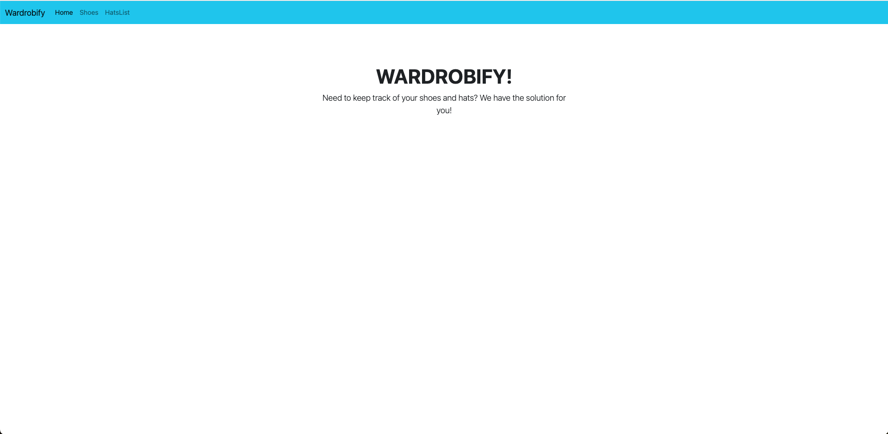
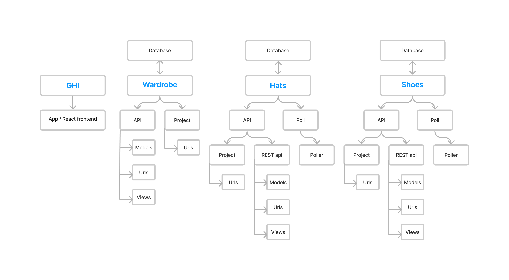
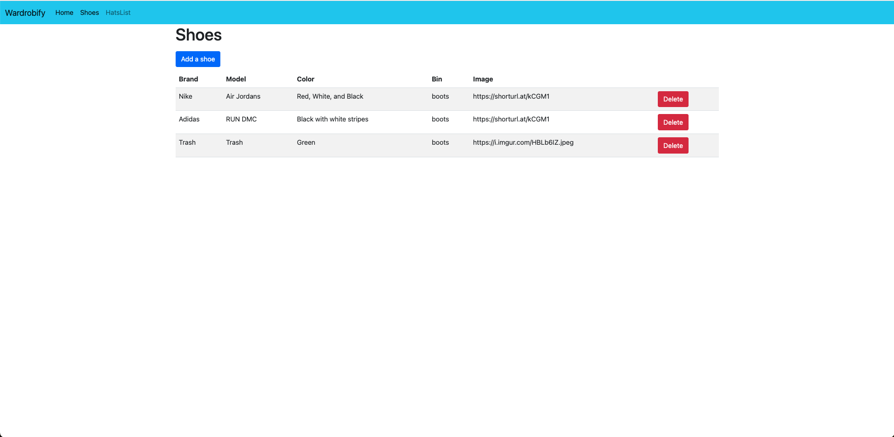
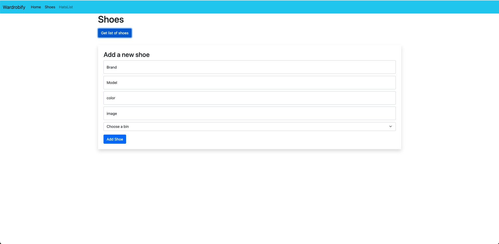
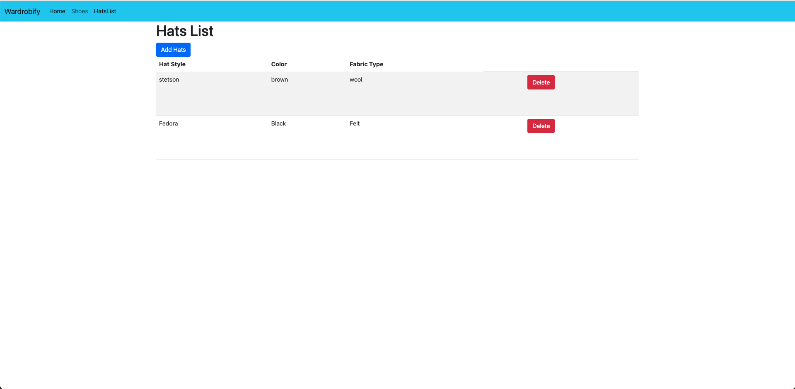
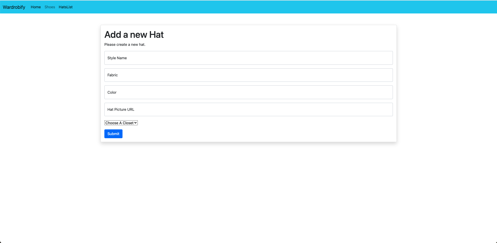

# Wardrobify

Wardrobify is a Django backend application which provides several microservices to interact with three backend databases so that users can manage their collections of shoes and hats.  The project runs these microservices using Docker with the frontend served in React.

Team:

* Anthony Spence - Hats
* Dennie Chan - Shoes

## Design

### Screen shot of the project home page

### Diagram of the project folder structure

## Shoes microservice

### React view of shoes from shoes microservice

### React form for adding shoes through the shoes microservice

For the Shoes microservice, we had one primary model with the following properties:
**model name**: The name of the shoe model
**manufacturer name**: The name of the shoe manufacturer
**color**: The color of the shoe
**picture url**: A link to a picture of the shoe
**assigned bin**: A foreign key which retrieves Bin information from the wardrobe microservice through polling.

## Hats microservice

Explain your models and integration with the wardrobe
microservice, here.
